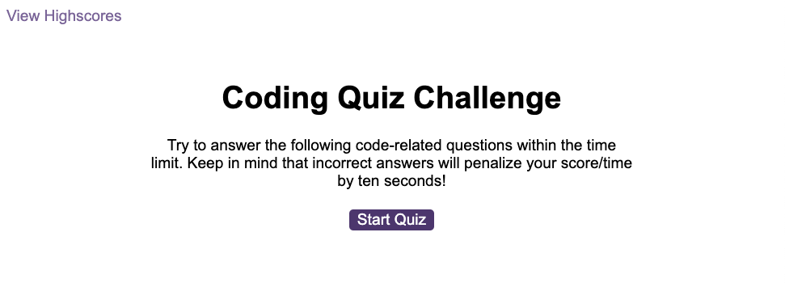
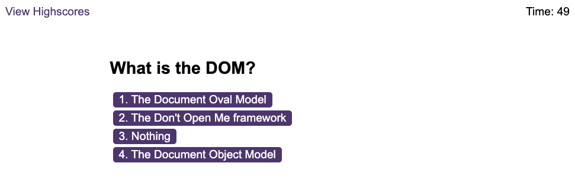
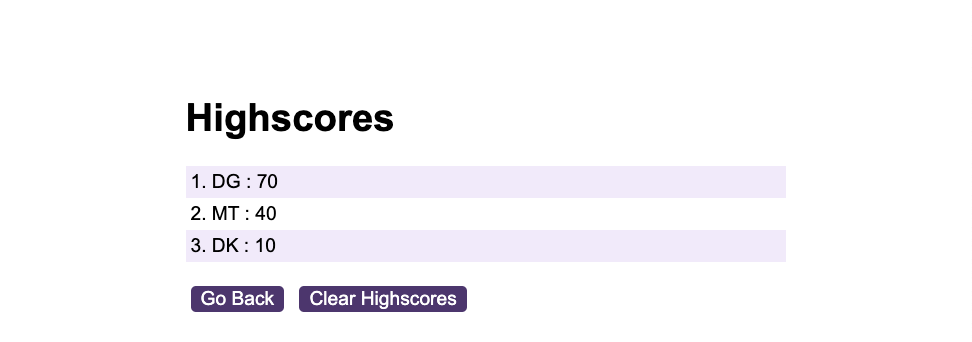

# Coding Quiz Game

This repository contains a JavaScript quiz web game that challenges users with coding-related questions. The game keeps track of the user's score and allows them to store their score along with their initials. Here's an overview of the project and its key features.

## Motivations

1. **DOM Tree:** The primary objective of this project was to demonstrate a strong understanding of event handling and the DOM in JavaScript. The game incorporates various event listeners, DOM manipulation, and element creation to manage user interactions effectively.

2. **Web Games:** This project serves as a practical example of building a web-based game that engages users and tests their knowledge of JavaScript concepts.

## What Was Done

1. **Leveraging Event Handlers:** The project significantly relies on event handlers to control the flow of the game. It begins with a "Start Quiz" button that triggers a series of questions with timed responses. Event handlers are used to handle user clicks, calculate scores, and transition between screens.

2. **Local Storage:** The project implements local storage to allow users to store their high scores and initials. This adds a competitive element to the game and provides a persistent record of user achievements.

3. **HTML Custom Attributes:** The project uses custom HTML attributes, such as `data-state`, to control the visibility and state of various elements on the page. This enables dynamic changes in the user interface as the game progresses.

## Problems Addressed

1. **Connecting Multiple Files:** The project demonstrates how to organize code into separate HTML, CSS, and JavaScript files. By linking these files correctly, the project maintains a clean and organized codebase.

2. **Dynamism:** The game dynamically generates and updates questions, choices, and feedback on the screen as the user progresses through the quiz. This showcases the power of JavaScript to create interactive and responsive web applications.

3. **Asynchronous Functions:** The project handles asynchronous functionality, such as timing the quiz and updating the user interface accordingly. It starts and stops a timer, providing a time constraint for answering each question.

## Insights Gained

Throughout the development of the "Quiz Game," several valuable technical lessons and skills were acquired:

- **Handling Events:** The project demonstrates how to set up event listeners and respond to user interactions effectively. It includes feedback mechanisms for correct and incorrect answers.

- **Event Propagation/Delegation:** The game employs event delegation to efficiently manage user interactions for a dynamic set of choices. It reduces the number of event listeners and improves performance.

- **Persistence:** The project showcases the use of local storage to persist user data, enabling high scores to be saved and retrieved across sessions.

- **Code Organization:** By breaking the project into separate HTML, CSS, and JavaScript files, code maintainability and readability are improved, facilitating collaboration and future development.

## Usage

To explore the Quiz Game and experience the interactive quiz, visit the deployed application at [Quiz Game](https://jimmygian.github.io/quiz-game/). Test your JavaScript knowledge and challenge your friends to beat your high score!

## Credits

This project was conceived, developed, and is actively maintained by Dimitris Giannoulis. The project's GitHub repository is available at [Quiz Game Repository](https://github.com/jimmygian/quiz-game/).

## License

This project is licensed under the MIT License, granting you the freedom to use and modify the code for your own projects. Feel free to customize it and adapt it to your needs.

## Links

- Deployed Application: [Quiz Game](https://jimmygian.github.io/quiz-game/)
- GitHub Repository: [Quiz Game Repository](https://github.com/jimmygian/quiz-game/)

Enjoy playing and learning with the Coding Quiz Game!
